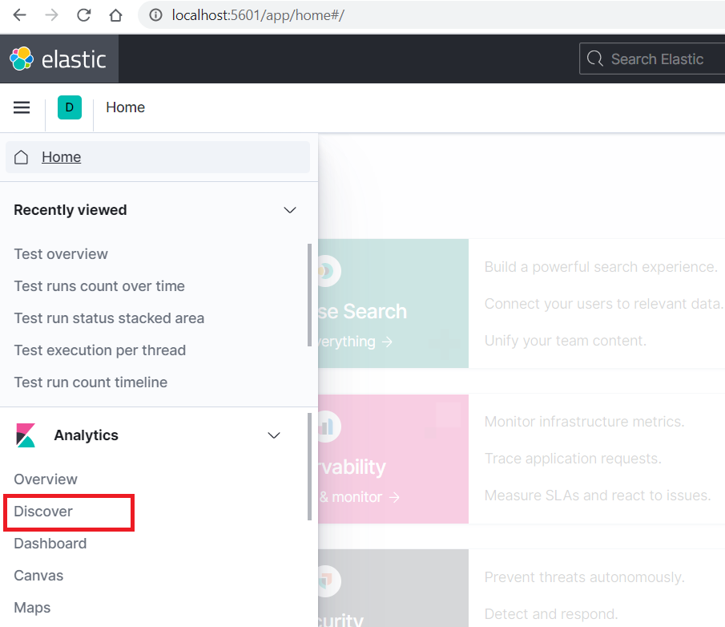
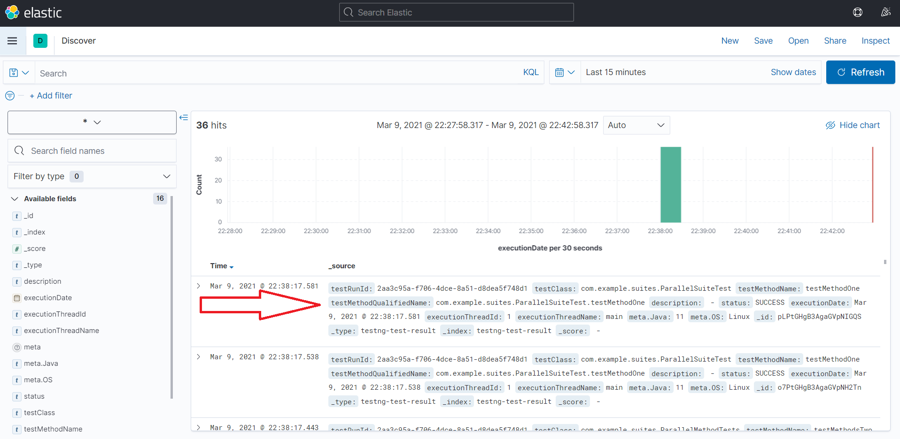

# testng-elasticsearch-test-result-listener
Simple Java library to extend your TestNG test suite execution with sending test results to Elasticsearch. You can also find an example Kibana dashboard template uploaded.

Based on: https://www.vinsguru.com/selenium-webdriver-real-time-test-execution-results-using-elasticsearch-kibana/

## How to build & run example
To take the compiled code and package it in its distributable format use the `mvn package` command:
```
> cd ./lib
> mvn package
```
The package with `.jar` extension should have created under the `/lib/target` directory.
The expected filename `testng-elasticsearch-extension-0.0.1-SNAPSHOT.jar`.

To build the `example-app` project and run the tests:
```
> cd ./lib
// install the package into the local repository, for use as a dependency in other projects locally
> mvn install
> cd ../example-app
// run the example-app tests 
> mvn test
```

To check the test results in Elasticsearch navigate to your [local Kibana dashboard](http://localhost:5601). 

In the navigation menu try find the **Discover** menu item under the **Analytics** section. 



**Note:** *To visualize and explore data in Kibana, you must create an index pattern to retrieve data from Elasticsearch.
Click the `+ Create index Pattern button` to create a default one. 
In the first step set the Index pattern name to `*`. 
In the second step select the `executionDate` from the drop-down menu to be used as `Time field
`. Click the `Create Index Pattern` button.*

You should see the test result documents data on this view that have been sent to the Elasticsearch server during the test run.




## How to use
### Add to your pom.xml 
Copy & paste the following to your project's pom.xml
```
    <dependency>
        <groupId>com.ktoth</groupId>
        <artifactId>testng-elasticsearch-extension</artifactId>
        <version>0.0.1</version>
        <scope>test</scope>
    </dependency>
```

### Configurations and properties
To configure your Elasticsearch server's host url try using the Maven Surefire plugin to specify property `testng.elasticsearch.url`

Example `pom.xml` snippet:

```
...
    <build>
        <pluginManagement>
            <plugins>
                <plugin>
                    <artifactId>maven-surefire-plugin</artifactId>
                    <version>2.22.1</version>
                    <configuration>
                        <systemPropertyVariables>
                            <!--http://www.javabyexamples.com/set-system-property-for-tests-->
                            <testng.elasticsearch.url>http://localhost:9200</testng.elasticsearch.url>
                        </systemPropertyVariables>
                    </configuration>
                </plugin>
            </plugins>
        </pluginManagement>
    </build>
```
### Annotate test classes

Example:
```
@Listeners(ElasticsearchTestResultListener.class)
public class AppTest {
    ...
}
```
### Use ServiceLoader
To apply the TestNG listener globally you only need to create a file with name `org.testng.ITestNGListener` 
in your project's test resources directory. Following the directory structure `test\resources\META-INF\services`
and the file simply needs to contain the listener class's package path:

```
com.ktoth.testng.elasticsearch.ElasticsearchTestResultListener
```

## Elasticsearch
### Indexes & Documents
- testng-test-result
```
GET /testng-test-result/_search HTTP/1.1
Host: localhost:9200
{
    "took": 10,
    "timed_out": false,
    "_shards": {
        ...
    },
    "hits": {
        "total": {
            "value": 122,
            "relation": "eq"
        },
        "max_score": 1.0,
        "hits": [
            {
                "_index": "testng-test-result",
                "_type": "testng-test-result",
                "_id": "V1De6ncB-vd3i6QNJLWT",
                "_score": 1.0,
                "_source": {
                    "testRunId": "e30229d9-7e33-4f9c-a8d1-3c82c4dfa243",
                    "testClass": "com.example.GreetingAppTest",
                    "testMethodName": "testGetName",
                    "testMethodQualifiedName": "com.example.GreetingAppTest.testGetName",
                    "description": "Test get name from application run args",
                    "status": "SUCCESS",
                    "executionDate": "2021-02-28T23:59:22.285+0100",
                    "executionThreadId": "1",
                    "executionThreadName": "main",
                    "meta": null
                }
            },
            ...
```
- testng-test-run
```
GET /testng-test-run/_search HTTP/1.1
Host: localhost:9200
{
    "took": 16,
    "timed_out": false,
    "_shards": {
        ...
    },
    "hits": {
        "total": {
            "value": 6,
            "relation": "eq"
        },
        "max_score": 1.0,
        "hits": [
            {
                "_index": "testng-test-run",
                "_type": "testng-test-run",
                "_id": "gVDe6ncB-vd3i6QNNrW4",
                "_score": 1.0,
                "_source": {
                    "testRunId": "e30229d9-7e33-4f9c-a8d1-3c82c4dfa243",
                    "startDate": "2021-02-28T23:59:21.760+0100",
                    "finishDate": "2021-02-28T23:59:27.792+0100"
                }
            },
            ...
```
